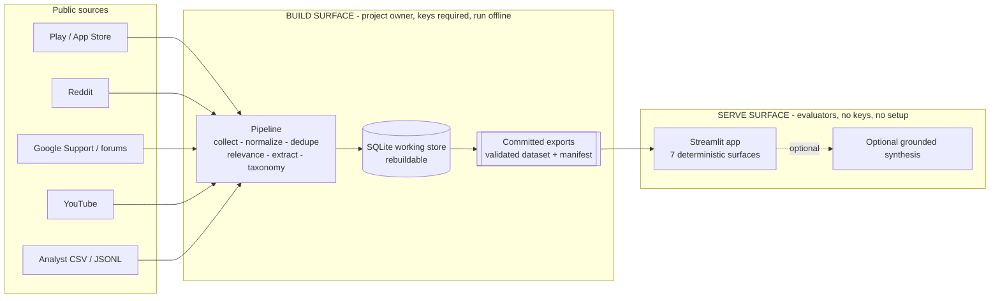
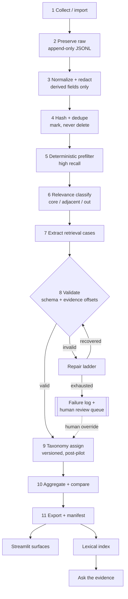
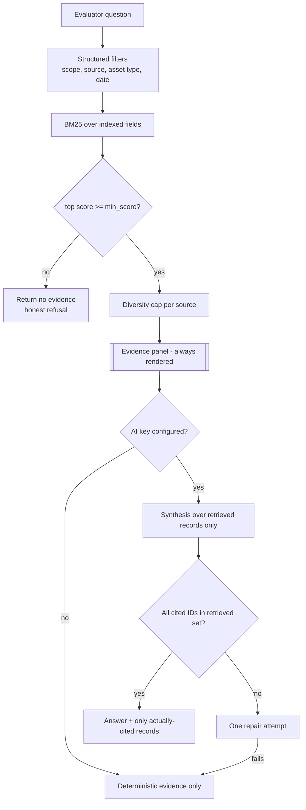

# Architecture — Google Photos Remembered-Item Retrieval Discovery Engine

> Companion to `problem-statement.md` (the authoritative specification).
> Document role: system architecture and design rationale. Version 1.1.
> Runtime: Python 3.12. Storage: SQLite + file-based artifacts. Interface: Streamlit.
>
> Where this document and `problem-statement.md` disagree, the problem statement wins.
> Every design choice below cites the specification section it satisfies, so the two can
> be diffed. Choices that go *beyond* the specification are marked **[ADR-n]** and listed
> in Section 22 for the project owner to approve into `DECISIONS.md`.

---

## 1. Repository state found

Inspected before writing this document:

```text
problem-statement.md                  authoritative specification (v1.1)
reference files/
├── app.py                    8 KB    Streamlit prototype, 4 tabs
├── rag.py                    2 KB    lexical rank + single Anthropic synthesis call
├── records.json              9 KB    16 flat "seed sample" records
├── explorer.html            18 KB    zero-dependency static explorer, data inlined
├── README.md                 3 KB    prototype deploy instructions
└── requirements.txt         27 B     streamlit, anthropic, pandas (unpinned)
```

There is no `.git` directory, no `src/`, no `prototype/`, no tests, and no data directories.
This is a greenfield build with a working reference prototype beside it.

The `reference files/` directory corresponds to the `prototype/` directory in
specification Section 14. Treat it as **read-only reference**. Its 16 records are not
validated research evidence (specification Section 30). Section 20 of this document
records exactly which prototype behaviours the architecture keeps and which it must
correct, with reasons.

---

## 2. What the architecture has to make true

The specification is unusually prescriptive about integrity rather than features. Five
requirements drive nearly every structural decision:

1. **An evaluator must be able to walk from a ranked opportunity claim back to the exact
   verbatim substring of a real post that supports it** (Section 31). This forces evidence
   to be a first-class stored entity with character offsets, not a text field on a record.
2. **Raw text is immutable and is the only coordinate space for evidence** (Sections 15.1,
   15.2). This forces a strict separation between the text used for auditing and the text
   used for matching, and it collides with the privacy redaction requirement — resolved in
   Section 9.
3. **Nothing invalid may silently enter the analysis dataset** (Section 17.12). This forces
   validation to be a gate between stages with its own failure store and review queue,
   rather than a defensive check inside the extractor.
4. **The deterministic application must work with no AI API key** (Sections 13.1, 22.3,
   23). This forces the LLM to sit behind a single narrow boundary that the presentation
   layer never depends on.
5. **Counts must be defensible: no duplicate inflation, no editorial voices counted as
   users, no single source dominating silently** (Sections 10, 11.2, 17.11, 21.4). This
   forces the *denominator* to be a defined, tested, queryable object rather than a
   `len()` call at render time.

### 2.1 Architectural invariants

These are the load-bearing rules. Each has a test that fails loudly if violated
(Section 19).

| # | Invariant | Source |
|---|---|---|
| I1 | `raw_text` is written once at collection and never updated. All cleaning produces derived records. | §15.1 |
| I2 | Every evidence offset addresses one coordinate space only: the immutable raw-text space. `normalized_text` is never used for offsets. | §15.2 |
| I3 | `quote == raw_text[start_char:end_char]` is verified by the store layer before a record can be marked valid. | §15.2 |
| I4 | Deduplication writes links; it never deletes or mutates a document, and duplicate status is never a lifecycle state. | §13.1, §17.11, §19.6 |
| I5 | A stage never calls another stage. Stages communicate only through the store. | §13.1 |
| I6 | Absence of a stated detail produces a null or empty value plus an observation status, never an inferred value and never an `unknown` placeholder. | §8.4, §17.5, §16.9 |
| I7 | Every LLM-derived record carries `model_name`, `prompt_version`, and schema version. `taxonomy_version` is carried **only** by `ClusterAssignment`. | §15.4, §15.9, §19.5 |
| I8 | The presentation layer reads committed exports only; it cannot write, classify, or extract. | §13 |
| I9 | Synthetic fixtures carry `evidence_tier = synthetic_test` and are excluded by every analysis query, not by convention. | §17.13 |
| I10 | Taxonomy cluster labels do not exist in code, in `RetrievalCase`, or in config before the pilot review produces them. | §20 |
| I11 | No contract requires a field that a later stage produces. `CollectedDocument` validates with no derived record present anywhere. | §15.0, §15.1 |
| I12 | Every evidence-required field in the §15.10 map has field-level evidence, or an observation status that permits its absence. `all_evidence_spans` is the derived union and is never the only evidence relationship. | §15.10, §17.16 |
| I13 | `is_relevant` is derived from `scope_class`; a model-supplied value is discarded and a stored conflict is rejected. | §15.3, §17.15 |
| I14 | Processing progress is the append-only `StageEvent` history. No single column claims to summarize a document's position in the pipeline. | §15.8, §21.1 |
| I15 | A technical failure is recorded in `technical_state` and excluded from every finding, precision, recall, and prevalence calculation, with the excluded count stated. | §16.10, §17.18 |
| I16 | Every identifier is derivable at the stage that assigns it; `doc_id` is derivable at import. Canonical duplicate selection is the lowest `doc_id`, never collection order. | §26.1 |
| I17 | Content-equivalence hashes exclude run IDs and execution timestamps. Rebuild equality is identical canonical content hashes, not byte-identical manifests. | §26.4 |
| I18 | The committed public export carries no usernames, credentials, or unredacted PII, and no raw text beyond the permitted excerpt. Verified against the generated artifact. | §12.1 |

---

## 3. Context: two surfaces, one dataset

The system has two audiences that must not share a runtime path. The prototype's README
already draws this line correctly and the architecture keeps it.



Consequences of the split:

- The evaluator app never needs database credentials, scraper keys, or an LLM key to
  deliver its first six surfaces (Section 23).
- The working SQLite database is **rebuildable, not precious**. It is a projection of the
  immutable raw files plus the response cache, so it does not need to be committed.
- What *is* committed is the validated export plus a run manifest, which is what makes the
  numbers in the README, the deck, and the app agree (Section 27).

---

## 4. Pipeline architecture

The specification's Section 13 flow becomes eleven stages. Each stage is an idempotent
function over the store: given the same inputs and the same versions, re-running it
produces identical identifiers and content-equivalent outputs — equal canonical content
hashes once volatile run fields are excluded (Section 8.2, spec §26.4).



### 4.1 Stage contracts

| Stage | Reads | Writes | Must not | Spec |
|---|---|---|---|---|
| 1 Collect | source APIs, `data/manual/` | `data/raw/**.jsonl`, `ingest_batches` | classify, judge relevance, clean text | §13.1, §11.3 |
| 2 Preserve | raw JSONL | `collected_documents` | alter `raw_text`, require a derived field | §15.0, §15.1 |
| 3 Normalize | `collected_documents` | `documents_derived` | overwrite raw text | §13.1, §15.6 |
| 4 Dedupe | `documents_derived` | `duplicate_links`, `review_queue` | delete rows, set a lifecycle state, auto-collapse short or cross-author text | §17.11, §19.6 |
| 5 Prefilter | `documents_derived` | `prefilter_results` | make a final research claim | §19.1 |
| 6 Relevance | prefilter output | `relevance_decisions`, `evidence_spans` | run full extraction, predict `is_relevant`, record a technical failure as `out_of_scope` | §19.2, §15.3 |
| 7 Extract | relevant docs only | `retrieval_cases`, `case_labels`, `evidence_spans` | invent absent facts, assign a cluster, read the taxonomy | §19.3, §17, §15.4 |
| 8 Validate | candidate records | validity flags, `extraction_failures`, `review_queue` | coerce or relax to pass | §17.12, §29.12 |
| 9 Taxonomy | valid cases | `cluster_assignments` | hard-code clusters pre-pilot, re-run extraction | §20, §19.5 |
| 10 Analyze | validated views | in-memory frames, `analysis_snapshots` | recount duplicates or editorial as users, define its own status vocabulary | §21, §16.9 |
| 11 Export | validated views | `data/processed/`, `data/exports/public/`, manifest | export unvalidated records, exceed the excerpt window | §26, §12.1 |

Every stage also appends `StageEvent` rows for `started`, `succeeded`, `failed`, `skipped`, `dropped`, and `unavailable`, with reason codes (§15.8). That event stream, not a status column, is what the funnel reads.

Stage 5 exists specifically so the expensive stages are protected: the deterministic
prefilter is tuned for **recall, not precision** (Section 19.1), because a document it
drops never gets a classifier opinion. Its drop reasons are stored so the recall cost is
measurable against the gold set rather than assumed.

### 4.2 Orchestration

`main.py` is a thin CLI over a stage runner. The runner owns the cross-cutting behaviour
the specification requires in Section 19.5 — checkpointing, resumption, small batches,
dry-run — so no individual stage reimplements it.

```text
python main.py run --stages normalize,dedupe --limit 50 --dry-run
python main.py run --resume <run_id>
python main.py rebuild            # drop DB, replay raw + cache, expect identical hashes
python main.py export --tag pilot-01
```

`rebuild` is the reproducibility proof. Because every identifier is content-derived and
every LLM response is cached by content, replaying a run offline must reproduce the same
**canonical content hashes** for every exported artifact (Section 7.4). A mismatch means
something non-deterministic leaked into the data, and the manifest makes that visible
instead of subtle.

---

## 5. Processing status: append-only stage events

There is no document lifecycle column. Progress is an append-only event log, one row per
`(target, stage, attempt)`, and the current status at a stage is the latest event for that
pair (spec §15.8).

```text
stage_events  (append-only, never updated)
  target_type   document | case | batch
  target_id     doc_id | case_id | ingest_batch_id
  stage         import | normalize | dedupe | prefilter | relevance
                | extract | validate | taxonomy_assign | analyze | export
  status        started | succeeded | failed | skipped | dropped | unavailable
  reason_code   required for every status except succeeded
  attempt, run_id, occurred_at, detail
```

### 5.1 Why a single lifecycle column was wrong

The earlier design had one `doc_state` column moving through
`collected → normalized → canonical | duplicate_marked → prefilter_passed → classified_* →
extraction_* → included`. It reads cleanly and it cannot express what actually happens,
because the states are not mutually exclusive:

- A document can be **both** a duplicate **and** successfully extracted. `duplicate_marked`
  and `extraction_valid` are simultaneously true, and a single column has to discard one of
  them. Whichever it discards, the funnel is wrong: either duplicates vanish from the
  duplicate line once they are extracted, or extractions vanish from the extraction line
  once a duplicate link appears.
- A document can fail extraction once and succeed on retry. A column shows the last state;
  the quality report needs both events.
- A document's position is genuinely plural. It is imported *and* normalized *and*
  prefilter-passed *and* classified *and* extracted, all at once, permanently.

The `GROUP BY` over one column that made the old funnel cheap is exactly what made it
lossy. Spec §21.1 asks for each of those lines to be reported separately, which a
mutually-exclusive column cannot do by construction.

### 5.2 What the event log gives instead

- **The funnel is per-stage.** One `GROUP BY (stage, status, reason_code)` produces every
  line in spec §21.1, and a document correctly appears at every stage it reached.
- **Duplicate status is orthogonal.** It lives in `duplicate_links` (§15.7) and is not a
  stage at all. Duplicate documents keep flowing through the pipeline and keep their
  extracted cases; they are excluded at the *analysis* layer by the prevalence views, not
  dropped at ingest. This preserves auditability while preventing inflation (§17.11).
- **Failures and unavailability are ordinary statuses with reason codes**, so they are
  countable per stage rather than inferred from an absence — and a retry is two events, not
  an overwrite.
- **Review is not a state of the document.** A `review_queue` item targets a document, a
  case, or a duplicate link. Resolving it appends an event and, where relevant, a row in
  `human_overrides`; it never rewrites history.

The convenience the old design bought is preserved by a view rather than a column:
`v_stage_status` resolves the latest event per `(target_id, stage)`, so queries stay simple
while the underlying history stays complete.

---

## 6. Data architecture

Three tiers with different durability guarantees. Confusing them is the most common way a
project like this loses reproducibility, so the tiers are physically separate directories.

| Tier | Location | Guarantee | Committed to git |
|---|---|---|---|
| **Source of truth** | `data/raw/**.jsonl`, `data/manual/`, `data/gold/` | append-only, immutable | raw: **no** (privacy, spec §12.1); gold labels: yes |
| **Working projection** | `data/interim/engine.db`, `data/interim/cache/`, `data/interim/index/` | fully rebuildable | no |
| **Published artifact** | `data/processed/`, `data/exports/public/`, `data/exports/runs/` | validated, versioned, content-hashed, public-profile only | yes |

The public artifact follows the export profile in spec §12.1: minimum redacted excerpt
around validated evidence spans, provenance and source URLs, no usernames, no credentials,
no unredacted PII, and full text only where redistribution terms explicitly permit it. The
complete corpus stays in the local tier.

Gold labels are two files with separate schemas and a frozen split:

```text
data/gold/documents.jsonl    GoldDocumentLabel — one per document, split: dev | holdout
data/gold/cases.jsonl        GoldCase — zero, one, or many per document
```

Raw files are partitioned for traceable, resumable ingestion:

```text
data/raw/{source_platform}/{YYYY-MM}/{batch_id}.jsonl
```

**[ADR-1] SQLite as a rebuildable projection, not the system of record.** The alternative
— treating the database as authoritative — is simpler day to day but makes the immutability
requirement (I1) a matter of discipline rather than structure, and it means a corrupted or
lost database loses the corpus. Append-only JSONL as truth also gives the pilot corpus a
natural review format and makes `rebuild` a meaningful test.

### 6.1 Table catalogue

Immutable projection:

- `collected_documents` — Section 15.1 fields verbatim, including `raw_text_sha256` and
  `source_url_key`. Primary key `doc_id`. No `UPDATE` or `DELETE` is permitted against this
  table; enforced by a store-layer guard and a test. **No column in this table is produced
  by a later stage** (I11) — a test asserts the column set against the Phase 1 model, so a
  derived field cannot drift back in.
- `ingest_batches` — `batch_id`, source, `collection_method`, `collection_query`, operator,
  counts, started/finished timestamps. Satisfies "store the collection method and query for
  every document" (Section 11.3) at batch granularity while keeping the per-document copy.

Derived per document:

- `documents_derived` — Section 15.6: `doc_id`, `normalized_text`, `raw_text_audit`,
  `canonical_url`, `content_hash`, `simhash`, `token_count`, `redaction_spans` (JSON),
  `language_detected`, `language_detector_version`, `normalizer_version`, `derived_at`.
- `duplicate_links` — Section 15.7: `link_id`, `doc_id`, `canonical_doc_id`,
  `duplicate_kind`, `similarity`, `method`, `method_version`, `method_detail` (JSON),
  `review_state`, `review_reason_code`, `decided_by`, `decided_at`.
- `prefilter_results` — `doc_id`, `passed`, `matched_rules` (JSON), `drop_reason_code`,
  `score`, `ruleset_version`.

Decisions and cases:

- `relevance_decisions` — Section 15.3 fields, including `technical_state` and the derived
  `is_relevant`, plus `decision_fingerprint`. Primary key `(doc_id, decision_fingerprint)`.
  A `CHECK` constraint enforces the `is_relevant` derivation, so a disagreement cannot be
  written even by a direct SQL insert.
- `retrieval_cases` — Section 15.4 scalar fields and every `*_observation` field, plus
  `extraction_fingerprint`. Primary key `(case_id, extraction_fingerprint)`. **No
  `candidate_cluster`, no `cluster_confidence`, no `taxonomy_version`** — a test asserts
  their absence from the column set.
- `case_labels` — one row per `ObservedValue`: `case_id`, `dimension`
  (`remembered_cues` | `forgotten_information` | `query_strategies` | `system_responses` |
  `workarounds` | `impact_signals` | `target_subjects`), `value`, `detail`, `evidence_id`
  (`NOT NULL`).
- `evidence_spans` — `evidence_id`, `owner_type` (`relevance_decision` | `retrieval_case` |
  `observed_value` | `severity` | `gold_case`), `owner_id`, `doc_id`, `field_name`, `quote`,
  `start_char`, `end_char`, `speaker`, `offset_state`, `validation_state`, `repair_applied`.
  `field_name` is constrained to the evidence-required map (Section 9.5), so a span cannot
  be attached to a field that does not require evidence — which is what makes
  `all_evidence_spans` a derivable union rather than a second, competing store.

Processing status and taxonomy:

- `stage_events` — Section 15.8, append-only. Primary key `event_id`. No `UPDATE`
  permitted; enforced by the same store-layer guard as `collected_documents`.
- `cluster_assignments` — Section 15.9: `case_id`, `taxonomy_version`, `cluster_id`,
  `confidence`, `method`, `model_name`, `prompt_version`, `assignment_fingerprint`,
  `assigned_at`. The only table carrying `taxonomy_version`.

Gold and export:

- `gold_document_labels` — Section 15.11, including `split`, `prefilter_should_pass`,
  `expected_case_count`, and `pre_adjudication_labels` (JSON).
- `gold_cases` — Section 15.11, zero to many per document.

**[ADR-2] Labels are rows, not JSON arrays.** Section 15.5 defines a label as a
`{value, evidence}` pair. Storing those pairs as relational rows means the memory-map
cross-tab (Section 21.2) and every distribution in Section 21.4 are direct aggregate
queries with the evidence join intact, and it makes "every label has evidence" a foreign-key
constraint instead of a code path. The Pydantic models still present nested objects; the
store flattens on write and rehydrates on read.

Quality, review, provenance:

- `extraction_failures` — `doc_id`, `stage`, `attempt`, `error_class`, `validation_errors`
  (JSON), `raw_response_ref`, `occurred_at`.
- `review_queue` — `item_id`, `target_type`, `target_id`, `reason_code`, `priority`,
  `state`, `opened_at`, `resolved_at`, `resolver`.
- `human_overrides` — append-only: `override_id`, `target_type`, `target_id`, `field_path`,
  `value_json`, `evidence_id` (nullable), `rationale`, `author`, `created_at`.
- `runs` — `run_id`, timestamps, `git_commit`, `config_hash`, `versions` (JSON),
  `funnel_counts` (JSON), `failure_counts` (JSON), `output_hashes` (JSON).
- `stage_checkpoints` — `run_id`, `stage`, `target_id`, `status` — the resumption ledger.
- `taxonomy_versions` — `version`, `created_at`, `definition_hash`, `notes`.

### 6.2 Views: the denominator as a first-class object

Analysis and the app query views only. This is how Section 21.6's claims discipline becomes
structural: it is hard to accidentally write "18% of users" when the only available object
is named `v_prevalence_core_direct`.

| View | Definition | Purpose |
|---|---|---|
| `v_stage_status` | latest `stage_events` row per `(target_id, stage)` | current position at each stage, without a lifecycle column |
| `v_funnel` | `stage_events` grouped by `(stage, status, reason_code)` | Section 21.1, per stage |
| `v_confirmed_duplicates` | `duplicate_links` where `review_state IN (auto_confirmed, human_confirmed)` | the only links that suppress a document from prevalence |
| `v_duplicates_pending` | `duplicate_links` where `review_state = pending_review` | its own funnel line; excluded from both the duplicate count and the collapse logic |
| `v_canonical_documents` | documents with no row in `v_confirmed_duplicates` | the deduplicated corpus |
| `v_current_relevance` | latest `decision_fingerprint` per `doc_id` where `technical_state = 'ok'`, human override wins | current scope truth |
| `v_relevance_unavailable` | latest decision per `doc_id` where `technical_state <> 'ok'` | technical failures, never counted as `out_of_scope` |
| `v_current_cases` | latest `extraction_fingerprint` per `case_id`, human override wins | current case truth |
| `v_valid_cases` | `v_current_cases` where `validation_state = 'valid'` | schema/evidence gate |
| `v_prevalence_core_direct` | `v_valid_cases` ∧ scope `core_incomplete_recall` ∧ `evidence_tier = direct_user` ∧ present in `v_canonical_documents` ∧ tier ≠ `synthetic_test` | **default headline denominator** |
| `v_prevalence_core_adjacent` | as above, scope in (core, adjacent) | the Section 23.2 scope toggle |
| `v_contextual_cases` | `evidence_tier IN (second_hand, contextual_editorial)` | context only, never counted as users |
| `v_case_clusters` | `cluster_assignments` at the active `taxonomy_version`, latest `assignment_fingerprint` | the only source of a cluster label |
| `v_source_weights` | per-source case counts and normalisation weights | Section 11.2 balancing |

`v_prevalence_core_direct` encodes four separate specification rules at once (evidence
hierarchy levels 1–4, duplicate exclusion, synthetic exclusion, core/adjacent separation).
Because it is one object, those rules are tested once and cannot be partially applied by a
careless chart.

Three of these views exist specifically to keep an ambiguity visible rather than resolved by
default. `v_duplicates_pending` means an unreviewed duplicate backlog shows up as a number
instead of silently biasing prevalence in one direction or the other.
`v_relevance_unavailable` means a provider outage is a reported count rather than a pile of
apparently-irrelevant documents. And because cluster labels exist only in `v_case_clusters`,
a chart cannot reach a cluster label through a case row — there is nothing there to reach.

---

## 7. Identity and hashing

Every identifier is derived from content or from stable source keys, never from insertion
order, autoincrement, or wall-clock time. This is what makes re-running produce identical
IDs (Phase 3 acceptance criteria).

### 7.1 Document identity, available at import

`doc_id` is derived from collection-time values only, per spec §26.1:

```text
doc_id = {platform}-{sha1(platform | natural_key)[:12]}

natural_key:  source_item_id
        else  source_url_key                      import-time normalized URL
        else  sha1(source_name | author_hash_or_"anon"
                   | published_at_iso_or_"" | raw_text_sha256)
```

The third fallback previously used `content_hash`, which is produced by Phase 3
normalization. That made `doc_id` undefinable at import: manual import could not assign an
identifier without running the normalizer, which broke the phase independence that I11 now
states, and it meant a change to the canonicalization rules silently changed every manual
row's identity. `raw_text_sha256` is a pure function of the collected text, so it is
available at import and stable under any later normalizer revision.

`source_url_key` is a deliberately *light* normalization — lowercased scheme and host,
fragment dropped, known tracking parameters dropped, trailing slash collapsed. The heavier
`canonical_url` in `documents_derived` may resolve share links and redirects, which can
require a network call and therefore cannot participate in an import-time identifier.

| Identifier | Construction |
|---|---|
| `doc_id` | as above |
| `raw_text_sha256` | `sha256(raw_text)` — collection time |
| `content_hash` | `sha256` of canonicalised text: NFKC, lowercase, collapsed whitespace, stripped URLs and punctuation — Phase 3 |
| `simhash` | 64-bit simhash over 3-word shingles of `normalized_text`, for near-duplicate blocking |
| `author_hash` | `HMAC-SHA256(AUTHOR_SALT, platform \| username)[:16]`; salt lives only in `.env`, `author_salt_id` records which one |
| `case_id` | Section 7.3 |
| `decision_fingerprint` | `sha1(model \| prompt_version \| ruleset_version \| schema_version \| content_hash)[:10]` |
| `extraction_fingerprint` | `sha1(model \| prompt_version \| schema_version \| content_hash)[:10]` — **no `taxonomy_version`** |
| `assignment_fingerprint` | `sha1(model \| prompt_version \| schema_version \| taxonomy_version \| content_hash)[:10]` — the only fingerprint with `taxonomy_version` |
| `evidence_id` | `sha1(owner_id \| field_name \| start_char \| end_char \| sha1(quote))[:12]`, offsets omitted when unresolved |
| `link_id` | `sha1(doc_id \| canonical_doc_id \| method)[:12]` |
| `event_id` | `sha1(run_id \| stage \| target_id \| attempt \| status)[:12]` |

**`extraction_fingerprint` in the primary key** lets a corpus hold cases from an older
prompt version alongside a newer one without either overwriting the other or duplicating
counts. `v_current_cases` resolves which is live; prior versions stay for reproducibility
(Section 20.1 step 9).

### 7.2 Canonical duplicate selection: lowest `doc_id`

The canonical document of a duplicate group is the one whose `doc_id` sorts first under
byte-wise ascending comparison.

The previous rule was "first-collected document is canonical", and it was not a property of
the documents at all. It depended on which source ran first, how a batch paginated, whether
a run was resumed from a checkpoint, and — for manual rows — which order an analyst happened
to paste them in. Two runs over the same corpus could legitimately pick different canonical
documents, which changes which `source_url` an evaluator is shown for the same piece of
evidence, and which breaks the Phase 3 acceptance criterion that re-running produces
identical duplicate assignments.

Lowest `doc_id` is total, order-independent, and reproducible, and because `doc_id` values
are unique by construction there are no ties to break. `tests/test_dedupe.py` shuffles
ingestion order and asserts every `canonical_doc_id` is unchanged.

### 7.3 Case identity, ties, and unresolved offsets

```text
case_id = {doc_id}#c{ordinal:02d}       ordered, valid cases
case_id = {doc_id}#u{sha1(payload)[:8]} unordered, offsets unresolved
```

Ordering by evidence position rather than model output order matters because a model may
emit two cases from one post in either order across runs, and `case_id` is what the Ask
surface cites and what evaluators bookmark. The ordinal sorts on
`start_char`, then `end_char`, then `sha1(quote)`, then `sha1(canonical_case_payload)`
(spec §26.3).

The last two keys are not theoretical. One sentence can support two distinct retrieval
needs, in which case two cases share a first-evidence span at identical offsets, and
position alone cannot order them. Without a tie-break the ordinal would depend on whatever
order the sort happened to receive, which is the model-output-order problem reintroduced by
the back door.

A case whose spans cannot be offset-resolved gets the `#u` form, is never persisted as
valid, never enters analysis, and always enters the review queue with
`evidence_offsets_unresolved`. Missing offsets are recovered when the quote occurs exactly
once; an ambiguous tie with no positional hint is routed to a human rather than resolved by
picking the first occurrence, because an arbitrary offset that validates is worse than a
visible gap — it looks verified.

---

## 8. The cache key is the reproducibility contract

Section 19.5 lists what must be in the cache key. Practically, the cache key defines when
work is repeated, and getting it wrong is the difference between a reproducible corpus and
an expensive one.

- Cache entries live in `data/interim/cache/{prefix}/{cache_key}.json` and store the
  request, the raw response, the provider, the model, and the timestamp.
- The key is `sha256` over canonical JSON of: provider, model, prompt id and version, schema
  version, `content_hash`, and decoding parameters.
- A change to a prompt, the schema, the model, or the document's content produces a new key,
  so stale interpretations can never survive a prompt edit.

### 8.1 `taxonomy_version` is scoped to taxonomy stages

`taxonomy_version` is in the cache key for taxonomy candidate generation and taxonomy
assignment, and absent from prefilter, relevance, extraction, and Ask synthesis.

It was previously in every key. The consequence was that publishing taxonomy `v2`
invalidated every cached extraction and re-ran the entire corpus through a paid model to
produce byte-identical extractions, because extraction never reads the taxonomy. That is not
just wasted spend: it creates a standing financial incentive not to revise the taxonomy,
which is in direct opposition to spec §20's requirement that the taxonomy be refined against
evidence and re-assigned across the corpus. Scoping the key makes a taxonomy revision cost
one assignment pass.

Because the raw response is stored, `main.py rebuild` replays an entire corpus with **no
API key at all**. That property is what makes analysis reproduction achievable for an
external evaluator without credentials or budget — and spec §12.1 is explicit that analysis
reproduction, not source re-collection, is what is being promised.

### 8.2 Rebuild equality is content equality

`rebuild` asserts **identical canonical content hashes** for every exported artifact, not
byte-identical run manifests (spec §26.4).

A manifest legitimately differs run to run: new run ID, new timestamps, new durations,
possibly a different git commit, possibly different token counts because some responses came
from cache. A byte-identical requirement would fail for reasons unrelated to the data, and
the predictable response to a test that cries wolf is to weaken or skip it — at which point
genuine non-determinism stops being caught, which is the entire purpose of the check.

Artifacts are canonicalised before hashing: records sorted by primary key, object keys
sorted, numbers normalised, and volatile fields removed — `run_id`, execution timestamps
(`occurred_at`, `derived_at`, `decided_at`, `extracted_at`, `assigned_at`, run start and
end), durations, token and request counts, hostname, PID, local paths, and cache hit status.
`collected_at` and `published_at` are **not** excluded: they are properties of the document,
not of the run. The exclusion list is written into the manifest so a reader knows exactly
what was compared.

---

## 9. Evidence architecture

This is the heart of the system, and it is where the specification contains a genuine
internal tension that the architecture has to resolve rather than paper over.

### 9.1 The conflict

Section 15.2 requires `quote == raw_text[start_char:end_char]`. Section 12 requires that
emails, phone numbers, and other personal identifiers be removed, and that processed
exports contain no plaintext author identity. Naive redaction shortens or lengthens the
text and silently invalidates every offset downstream of the edit.

### 9.2 Resolution: length-preserving redaction, one coordinate space

Three text fields, one offset space:

| Field | Record | Content | Used for | In public export |
|---|---|---|---|---|
| `raw_text` | `CollectedDocument` | exactly as collected | the offset coordinate space, local audit | no |
| `raw_text_audit` | `DocumentDerived` | `raw_text` with each PII span replaced by a mask of **identical character length** | evidence validation, LLM input, evaluator display | excerpt only |
| `normalized_text` | `DocumentDerived` | NFKC, lowercased, whitespace-collapsed | dedupe, prefilter, lexical retrieval | no |

Because masking preserves length, `start_char`/`end_char` are valid against both
`raw_text` and `raw_text_audit`, and I3 can be validated in either environment. Two
supporting rules:

- **An evidence span that overlaps a redacted region is rejected.** Evidence must never
  depend on personal data. This is a validation rule, not a display rule.
- **`raw_text_audit` is what is sent to the model provider.** No unredacted personal data
  leaves the machine — a privacy property the prototype does not have, and one that costs
  nothing given length-preserving masks.

**[ADR-15]** `raw_text_audit` and `redaction_spans` live on `DocumentDerived` (spec §15.6),
not on the collected record. ADR-3 originally added them to `RawDocument`, which made the
collection contract depend on a Phase 3 output and left manual import unable to produce a
valid document without the normalizer. The length-preserving-mask technique is unchanged and
still load-bearing; only its home moved.

**What the public export carries is an excerpt, not this field.** Spec §12.1 limits the
committed artifact to the minimum redacted excerpt containing the validated spans, plus a
context window, with offsets rebased to the excerpt and `excerpt_start_char` recorded so the
mapping back to document coordinates stays explicit. Full `raw_text_audit` remains local.

### 9.3 Validation ladder

Applied by `extract/validator.py` before any record can be marked `valid`:

1. **Exact match.** `quote == raw_text[start:end]` → valid.
2. **Offset repair.** Quote is an exact substring at a different position → single
   unambiguous occurrence repairs the offsets; multiple occurrences select the one nearest
   the model's proposed offset and set `repair_applied`, so audits can find these.
3. **Whitespace-normalised repair.** Match ignoring whitespace runs → offsets recovered
   from the original text and the **original substring is what gets stored and displayed**
   (Section 15.2). The normalised form is never persisted as `quote`.
4. **Reject.** Anything else is fabrication. The span is rejected, the parent record is
   invalidated, the failure is logged, and the document enters the review queue.

Step 4 is deliberately unforgiving: a paraphrase that "nearly" matches is exactly the
failure mode Section 17 exists to prevent, and the prototype's records show how naturally
it happens (Section 20).

### 9.4 Speaker attribution

`EvidenceSpan.speaker` is what separates a user's own words from a quoted third party or
an editorial narrator (Sections 8.7, 8.8, 17.8). It is enforced at two levels:
`CollectedDocument.evidence_tier` sets the ceiling for a whole document, and `speaker`
refines it per span. A document tiered `contextual_editorial` cannot contribute
`speaker = author` spans to prevalence — the view in Section 6.2 filters on the document
tier, so no chart can reach around it.

The `unknown` speaker value is now `unattributed`: the source text does not attribute the
words. That is a statement about the document, not an analysis gap, and it should not share a
name with the placeholder values that spec §16.9 removed.

### 9.5 Field-level evidence enforcement

Spec §15.10 defines an evidence-required field map and a closed exception list. The
architecture makes both *data*, loaded once and consulted by the validator, rather than a set
of checks scattered through the extractor:

```text
src/models/evidence_map.py
    EVIDENCE_REQUIRED: dict[contract, set[field_name]]
    EVIDENCE_EXEMPT:   dict[category, set[field_name]]
```

Three mechanisms keep the map from drifting out of sync with the models:

1. **Completeness test.** `tests/test_evidence_map.py` walks the Pydantic field sets of
   `RelevanceDecision` and `RetrievalCase` and asserts every field appears in exactly one of
   the two dictionaries. A newly added field fails the suite until it is classified, so a
   substantive field cannot quietly arrive without enforcement.
2. **Database constraint.** `evidence_spans.field_name` is constrained to the required map.
   A span cannot be attached to an exempt field, and a required field's span cannot be
   attached to nothing.
3. **Status gate.** For each required field, the validator reads the paired
   `*_observation` value and applies the table in spec §15.10: `stated`, `explicitly_none`,
   and `uncertain` require at least one valid span; `not_stated` and `not_applicable` require
   none and require an empty value. A mismatch is a validation error routed to review, never
   a coercion.

**`all_evidence_spans` is computed, not stored as primary.** The validator derives it as the
de-duplicated union of every field-level span, including `severity_evidence` and every
`ObservedValue.evidence`, and discards any model-supplied value. A span present in the union
but attached to no field fails validation.

This closes a real loophole. When `all_evidence_spans` was the only evidence relationship, a
model could satisfy the evidence requirement in bulk — attach six plausible quotes to the
case, leave every individual field unevidenced, and pass. The record would look thoroughly
sourced and no single claim in it would be traceable, which is the precise failure spec §31
exists to prevent. Field-level spans are now primary and the union is a convenience over
them.

---

## 10. LLM boundary

All model access passes through one gateway. Nothing else in the codebase imports a
provider SDK — an import-boundary test enforces this, because the "works without an API
key" guarantee is trivially broken by a single stray top-level import.

```text
relevance/classifier.py ─┐
extract/extractor.py ────┼─→ llm.gateway.ModelGateway ─→ cache (hit? return)
retrieve/answer.py ──────┘                             ─→ provider adapter
                                                          ├─ anthropic
                                                          ├─ openai
                                                          └─ null (offline / no key)
```

The gateway owns: cache lookup and write, retry with backoff, timeouts, token accounting,
structured-output request shaping, and the repair ladder. Providers are thin adapters
behind a `Protocol` with one method, `complete_structured(prompt, schema, params)`. Model
names and providers come from `config/models.yaml`; none appear in source code
(Section 29.11) — a rule the prototype's hard-coded `ANSWER_MODEL` breaks.

The `null` provider is not a test double. It is the production path when no key is
configured: it returns "unavailable" cleanly so the pipeline records an honest failure and
the app falls back to deterministic evidence.

"An honest failure" has a specific storage shape. The gateway maps every non-success outcome
to a `DecisionTechnicalState` (spec §16.10) — `provider_unavailable`, `provider_error`,
`timeout`, `rate_limited`, `response_parse_failed`, `schema_validation_failed`,
`evidence_validation_failed`, `skipped_dry_run` — and the stage writes a record carrying that
state with a null finding. Nothing downstream may read a technical failure as a substantive
result: a `RelevanceDecision` with `technical_state <> 'ok'` has a null `scope_class` and
appears in `v_relevance_unavailable`, not in the `out_of_scope` count. Collapsing a provider
outage into "not relevant" would make a billing problem look like a research finding, and it
would do so in the direction that flatters the corpus.

### 10.1 Repair ladder as an explicit state machine

Section 19.4's ordering, with every transition recorded in `extraction_failures` so the
Phase 6 quality report can show *where* models fail rather than only how often:

```text
parse ──ok──→ validate ──ok──→ persist as valid
  │              │
  │ json error   │ schema or evidence error
  ↓              ↓
safe cleanup   repair prompt (errors fed back, original text re-supplied)
  │              │
  └──→ validate ─┴──ok──→ persist as valid (repair_applied = true)
                 │
                 │ still invalid
                 ↓
        one re-extraction from scratch
                 │ still invalid
                 ↓
        log failure + review_queue
        StageEvent(stage = extract, status = failed,
                   reason_code = extraction_invalid_after_repair)
```

"Safe cleanup" is restricted to syntax: fenced-code stripping, trailing commas, smart
quotes. It may not change a value, drop a field, or relax an enum. Coercion is how invalid
model output becomes invisible bad data, so the ladder has no coercion step at all
(Section 29.12).

---

## 11. Human review and overrides

Human judgement is the specification's designated resolution path for uncertainty
(Sections 19.2, 19.4, Phase 5 "human override support"), so it needs real structure rather
than manual database edits.

**The queue is built in Phase 3, not Phase 4.** Deduplication is the first stage that
produces review items — review-band similarity, short text below the minimum token length,
identical text from different authors, ambiguous quoted repeats (spec §19.6) — so the queue
has to exist before Phase 4 has anything to say. The earlier plan created the queue alongside
the relevance classifier, which left Phase 3 with review decisions and nowhere to record
them; the only available workarounds were to defer duplicate review until Phase 4 or to
auto-resolve the ambiguous band, and the second is exactly the irreversible error §19.6 is
written to avoid.

- **Queue entries** are opened automatically by: near-duplicate scores inside the ambiguous
  band, text below `dedupe_min_tokens`, identical text from differing author hashes, ambiguous
  quoted repeats, relevance confidence below the configured threshold, evidence validation
  failure, unresolved or ambiguous evidence offsets, exhausted repair ladder, severity
  asserted without evidence, observation-status conflicts, contradiction between prefilter and
  classifier, and any non-`ok` technical state.
- **Overrides are append-only rows, never in-place edits.** They carry an author, a
  rationale, and optional evidence, and they are applied as the highest-precedence layer in
  `v_current_*`. The model's original opinion survives beside the human's, which is what
  makes the Phase 6 error analysis possible at all.
- **Overrides set `extractor_type = human`**, keeping human and machine contributions
  distinguishable in the quality report (Section 23.7).

---

## 12. Taxonomy architecture

Section 20 forbids hard-coding the final taxonomy before the pilot. The architecture
enforces that by construction, not by good intentions.

- `config/taxonomy.yaml` ships with `version: 0-unassigned` and **no clusters**. Extraction
  writes `problem_summary` and nothing about grouping. `RetrievalCase` has no
  `candidate_cluster` field at all (spec §15.4), so there is no null to leave and no field for
  a later prompt revision to start populating "just provisionally". A test asserts the column
  is absent from `retrieval_cases`.
- Because `extraction_fingerprint` and the extraction cache key exclude `taxonomy_version`
  (Section 8.1), publishing a new taxonomy version re-runs assignment only. The taxonomy can
  therefore be revised as often as the evidence warrants, which is what Section 20.1 steps 5
  and 8 assume.
- Clustering is a **separate, later stage** reading validated cases. `taxonomy/candidates.py`
  proposes groupings from label co-occurrence and summary similarity to support the human
  review of the first 50–100 cases; it does not name clusters.
- A cluster is `established` only when it satisfies the gate in Section 20.1 step 6 — at
  least five independent documents across at least two source types. The flag is
  **computed** from `cluster_assignments`, never authored by hand, and the app renders
  provisional clusters distinctly. This makes Phase 8's first acceptance criterion
  mechanically true.
- `other` and `uncertain` are permanent members of every taxonomy version, so no case is
  forced into a cluster.
- Assignments are keyed by `(case_id, taxonomy_version)`, so re-running against the full
  corpus after a taxonomy revision adds rows and preserves prior versions rather than
  rewriting history.

---

## 13. Analysis architecture

`src/analyze/` is pure and deterministic: views in, dataframes out, no I/O to model
providers, no randomness, no wall-clock reads. Given the same export it produces identical
numbers, which is what lets the app, the README, and the deck agree (Section 27).

### 13.1 Counting rules

Every count declares its unit. The four units are not interchangeable, and Section 21.4
requires three of them side by side:

| Unit | Meaning | Used for |
|---|---|---|
| cases | rows in `v_prevalence_core_direct` | headline prevalence |
| documents | distinct canonical `doc_id` | corpus size |
| threads | distinct `parent_thread_id` (fallback `doc_id`) | duplicate-thread inflation control |
| authors | distinct non-null `author_hash` | independence check |

A cluster where 12 cases collapse to 2 threads is a *thread*, not a pattern. The comparison
table shows all four so that collapse is visible rather than buried — and the prototype's
seed data contains exactly this trap (Section 20).

### 13.2 Source balancing

Section 11.2 asks for disclosure and a balanced view, without discarding evidence:

- **Raw view** — actual counts, always available and always the default.
- **Source-balanced view** — a cluster's balanced share is the unweighted mean of its
  within-source shares, so a source contributing 200 cases and one contributing 20 have
  equal influence on shape while nothing is deleted.
- **Concentration guard** — when any source exceeds 40% of included cases, the app renders a
  persistent disclosure banner. The threshold lives in config; the disclosure is not
  optional and not dismissible.

### 13.3 Opportunity comparison and scoring

Section 21.5 is explicit that `count × average severity` is insufficient. Components are
therefore surfaced separately and always available:

`unique_cases` · `unique_threads` · `unique_authors` · `source_count` ·
`mean_severity` (evidence-backed only, with the count of nulls displayed) ·
`unresolved_or_abandoned_rate` · `recency_share` (share within the configured recent window)

A composite score is **optional and off by default**. When enabled it must, per
Section 21.5:

- read weights from `config/analysis.yaml` and display the formula and weights inline;
- compute on unique cases, not rows;
- publish a **sensitivity analysis** — rank stability under weight perturbation and under
  leave-one-source-out — so a ranking that only holds at one weighting is visibly fragile;
- render beside the disclaimer that it is a prioritisation aid, not a measurement.

`mean_severity` deserves a specific note: severity is null whenever it cannot be justified
(Section 18), so severity means are computed over a *smaller* denominator than case counts.
The analysis layer carries both numbers together and the app prints them together, because
a mean over 4 of 30 cases is a different claim than a mean over 30.

### 13.4 Memory map

The Section 21.2 cross-tab of remembered cues against forgotten information is a join over
`case_labels` and the `*_observation` columns, which means each cell can drill through to the
evidence spans behind it.

Two distinctions the prototype conflates and this layer must not (Section 8.4, I6):

- **`not_stated`** — the user said nothing about what they forgot. The default.
- **`explicitly_none`** — the user stated they remembered everything relevant.

These occupy separate rows and are never merged into a single "(none)" bucket, because
merging them silently converts silence into a finding.

**These statuses are schema values, not analysis-layer inventions.** Both are members of
`DimensionObservationStatus` (spec §16.9), produced by extraction, evidenced where the status
requires it, and stored in `retrieval_cases`. This document previously introduced them here,
in the analysis layer, which meant the distinction had to be *reconstructed* from an empty
list — and an empty list cannot tell you which of the two it is. The analysis layer now reads
the distinction; it does not invent it. More generally: no analysis module may define a status
value that does not exist in the schema, and `tests/test_analysis.py` asserts that every
status appearing in a cross-tab is a schema enum member.

---

## 14. Retrieval and Ask architecture

The prototype's shape — rank lexically, then synthesise from only the retrieved records
with inline `[id]` citations — is the right shape and Section 22 confirms it. The
architecture keeps it and adds the three controls that make it trustworthy: a threshold, a
diversity cap, and citation validation.



Design points:

- **Index scope** (Section 22.1): `problem_summary`, controlled labels, evidence quotes, and
  the `raw_text_audit` excerpt. Built with BM25 over `normalized_text` derivatives, cached
  under `data/interim/index/` keyed by dataset version. Embeddings are deliberately out of
  scope for Part 1 — the specification wants an auditable baseline first.
- **Minimum score** (Section 22.1): configurable. Below it, the system returns *nothing*.
  "Return no evidence for unrelated questions" is a hard requirement and has its own test,
  and it is the single most common failure of naive lexical rankers, which return `k`
  results regardless of quality.
- **Diversity cap**: a per-source ceiling within top-k so one talkative thread cannot
  monopolise an answer.
- **Citation validation** (Section 22.2): `[case_id]` tokens are parsed from the answer and
  checked against the retrieved set. Unsupported IDs trigger one repair attempt, then
  rejection. **The evidence panel renders the intersection of cited and retrieved** — not
  the retrieved list — so what an evaluator sees under "Evidence used" is what the model
  actually used.
- **Failure-safe** (Section 22.3): the evidence panel is rendered *before* synthesis is
  attempted, so a missing key, a provider outage, or a rejected answer degrades to
  deterministic evidence with the question preserved.
- **Cost guard**: grounded answers are cached on `(question_normalized, dataset_version,
  model, prompt_version)`, plus a per-session question cap for the public deployment
  (Section 22.3) — the prototype's README flags this need and the architecture makes it a
  configured limit.

---

## 15. Presentation architecture

`app.py` is a read-only projection of committed exports. It imports from `analyze`,
`retrieve`, and `store.export` — never from `collect`, `relevance`, `extract`, or a
provider SDK.

| Surface | Spec | Needs AI key |
|---|---|---|
| Overview: question, date range, source mix, funnel, direct vs contextual, limitations | §23.1 | no |
| Opportunity comparison: components, source-balanced toggle, core/adjacent toggle, filters | §23.2 | no |
| Memory map: cues × forgotten, combinations, unknown visibility | §23.3 | no |
| Retrieval journeys: strategy → response → workaround → outcome → impact | §23.4 | no |
| Evidence browser: excerpt with highlighted spans, source link, scope decision, versions, review status, download | §23.5 | no |
| Quality report: gold-set metrics, per-field accuracy, span validation rate, failure and duplicate rates, limitations | §23.7 | no |
| Ask the evidence | §23.6 | optional |

Guarantees:

- **Six deterministic surfaces load with no secrets.** Enforced by a test that runs the app
  with the environment stripped.
- **Empty states are designed, not incidental**: no export present, empty dataset, empty
  filter result, no established clusters yet, and no gold set yet each render an explanatory
  panel rather than an exception or a misleading zero.
- **Caching is keyed on dataset version**, so a refreshed export cannot be served from a
  stale cache.
- **Downloads serve the exact export the page rendered**, including its version and
  manifest hash, which is the Section 25 application test.
- **Evidence highlighting uses stored offsets** against the excerpt, rebased with
  `excerpt_start_char`, rather than re-searching for the quote at render time. Rendering is not
  allowed to become a second, unvalidated matching implementation.
- **The app reads the public export profile only** (spec §12.1). It never reads
  `data/raw/`, and a test asserts no code path from `app.py` reaches that directory. The
  surfaces therefore work identically on a deployment that has no access to the local corpus,
  which is what makes the public deployment honest rather than a special case.
- **`explorer.html`** is retained as a zero-dependency static snapshot for the Phase 11
  backup evidence export — regenerated from the committed export rather than hand-edited.

---

## 16. Configuration and observability

### 16.1 Configuration

Everything in Section 26 lives in `config/`, loaded through one typed settings object.
Nothing reads `os.environ` directly outside `core/config.py`.

```text
config/sources.yaml     enabled sources, queries, date ranges, language filters, rate limits
config/models.yaml      provider, model names, temperature, max tokens, timeouts, prompt versions
config/analysis.yaml    confidence thresholds, dedupe thresholds, weights, recency window,
                        top-k, min score, source-concentration threshold
config/taxonomy.yaml    taxonomy version + cluster definitions (empty until the pilot)
```

Secrets stay in `.env` / deployment secrets, documented in `.env.example`:
`ANTHROPIC_API_KEY`, `OPENAI_API_KEY`, `AUTHOR_SALT`, `REDDIT_CLIENT_ID`,
`REDDIT_CLIENT_SECRET`, `YOUTUBE_API_KEY`. `AUTHOR_SALT` is a secret with a consequence
worth stating: rotating it changes every `author_hash`, so it is fixed once per corpus and
recorded in the manifest by hash, never by value.

### 16.2 Run manifest

Every run writes `data/exports/runs/{run_id}.json` with the Section 26 contents: run ID,
timestamps, git commit, config hash, source counts, model and prompt versions, schema and
taxonomy versions, gold split rule and seed, per-stage funnel counts from `stage_events`,
failure counts by reason code and technical state, output-file **canonical content hashes**,
and the volatile-field exclusion list used to compute them.

The manifest is the mechanism behind the Definition-of-Done requirement that "dataset, app,
README, and methodology numbers agree" — the app reads its funnel from the manifest instead
of recomputing it, so a discrepancy is impossible rather than merely unlikely.

Recording the exclusion list in the manifest matters for the same reason: a reader comparing
two runs needs to know which fields were compared and which were deliberately ignored, or the
equality claim in Section 8.2 is unfalsifiable.

---

## 17. Module map and dependency rules

Section 14's structure, with additions marked `+`. Additions are consolidations of
cross-cutting concerns that Section 14 leaves implicit; each is listed in Section 22 for
approval.

```text
google-photos-retrieval-engine/
├── app.py                    Streamlit, read-only over exports
├── main.py                   CLI over the stage runner
├── pyproject.toml            pinned/bounded deps (replaces prototype requirements.txt)
├── problem-statement.md      specification (authoritative)
├── ARCHITECTURE.md           this document
├── STATUS.md  DECISIONS.md  CHANGELOG.md
├── .env.example  .gitignore
├── config/                   sources.yaml  taxonomy.yaml  models.yaml  + analysis.yaml
├── data/                     manual/ raw/ interim/ processed/
│                             gold/{documents,cases}.jsonl
│                             exports/{public,runs}/
├── prototype/                the current reference files, moved here, read-only
├── src/
│   ├── core/               + config.py  logging.py  ids.py  versions.py  errors.py
│   ├── models/               collected_document.py  evidence.py  retrieval_case.py
│   │                       + document_derived.py  duplicate_link.py  relevance.py
│   │                       + stage_event.py  cluster_assignment.py  gold.py
│   │                       + export.py  evidence_map.py  enums.py
│   ├── collect/              base.py  manual.py  youtube.py  reddit.py
│   │                         (no store or forum collectors — ADR-22)
│   ├── normalize/            text.py  privacy.py  canonicalize.py
│   ├── dedupe/               exact.py  near_duplicate.py
│   ├── relevance/            rules.py  classifier.py  prompts.py
│   ├── extract/              extractor.py  prompts.py  validator.py
│   ├── llm/                + gateway.py  cache.py  repair.py  providers/
│   ├── taxonomy/             candidates.py  assign.py
│   ├── analyze/              funnel.py  memory_map.py  journeys.py  opportunities.py
│   ├── retrieve/             rank.py  answer.py  citations.py
│   ├── review/             + queue.py  overrides.py
│   ├── pipeline/           + runner.py  stages.py  manifest.py
│   └── store/                database.py  migrations.py  export.py  + views.py
├── scripts/                  check_credentials.py  validate_dataset.py
│                             audit_sources.py  build_exports.py
└── tests/                    per Section 25, + test_architecture.py
```

**[ADR-4] `src/llm/` replaces `src/extract/cache.py`.** Section 14 places the cache under
`extract/`, but relevance classification and Ask synthesis need the same cache, retry, and
repair behaviour. Leaving it in `extract/` forces either duplication or a stage-to-stage
import, which violates I5. Prompts remain per stage as specified.

**[ADR-5] `src/review/` and `src/pipeline/` are new packages.** Section 14 implies a review
queue and a run manifest without giving them a home; they are cross-cutting and do not
belong to any single stage.

### 17.1 Dependency rules

```text
core        ← imported by everything, imports nothing internal
models      ← imports core only
store       ← imports core, models
llm         ← imports core, models
stages      ← import core, models, store, llm — never another stage
analyze     ← imports core, models, store (views only)
retrieve    ← imports core, models, store, llm
app.py      ← imports core, analyze, retrieve, store.export
```

`tests/test_architecture.py` asserts these edges, that no module outside `src/llm/providers/`
imports a provider SDK, and that `app.py` has no transitive path to `collect` or `extract`.
Layering that is only documented erodes; layering that fails a test does not.

---

## 18. Degradation matrix

The specification demands failure-safety in several places. Collected in one table so the
behaviour is designed rather than discovered:

| Condition | Behaviour | Spec |
|---|---|---|
| No AI key, pipeline | Prefilter, normalize, dedupe, analysis, export all run; relevance and extraction record `technical_state = provider_unavailable` with a null finding, counted on their own funnel line and excluded from every metric | §13.1, §16.10 |
| Provider outage mid-run | Same: technical state, never `out_of_scope`, never a zero-severity finding | §17.18 |
| Evidence offsets ambiguous | Span unresolved, case gets a `#u` id, review item opened; no offset is guessed | §26.3 |
| Short or cross-author near-duplicate | Review item, not an automatic collapse; excluded from the duplicate count until resolved | §19.6 |
| Duplicate review backlog | Reported as its own funnel line via `v_duplicates_pending` | §21.1 |
| Source has no documented permitted mechanism | Collector not built; source collected by manual import and labelled experimental | §11.4 |
| No AI key, app | Six deterministic surfaces normal; Ask returns retrieved evidence with a notice | §22.3, §23 |
| Provider error or timeout | Retry with backoff, then log failure, then review queue; no partial record persisted | §19.4 |
| Provider returns invalid JSON or schema | Repair ladder; on exhaustion, failure log and review, never coercion | §17.12, §29.12 |
| Collector blocked or rate-limited | Stop that source, record the reason in the manifest, continue other sources, fall back to manual import | §11.3, Phase 7 |
| Missing or corrupt export | App renders a setup panel explaining how to build the dataset | §23 |
| Empty filter result | Explanatory empty state showing which filter emptied the set | §25 |
| Unrelated Ask question | No evidence and an honest refusal, not arbitrary records | §22.1, §27 |
| Model cites an unknown ID | One repair attempt, then reject the answer and show deterministic evidence | §22.2 |
| Gold set absent | Quality report explains it is pending instead of showing zeros | §23.7 |
| No established clusters yet | Opportunity view shows provisional groupings, clearly labelled | §20.1 |

---

## 19. Test architecture

Section 25's test list maps onto the modules above. Beyond mirroring it, four tests exist
specifically to defend the invariants, because those are the failures that would silently
invalidate the research:

| Test | Defends |
|---|---|
| `test_architecture.py` — import boundaries; `app.py` has no path to `collect`, `extract`, or `data/raw/` | I5, I8, I18, and the no-key guarantee |
| `test_evidence.py` — fabricated quote, shifted offsets, duplicate occurrence, ambiguous tie routed to review, whitespace repair preserving displayed text, span overlapping a redaction rejected | I2, I3 |
| `test_evidence_map.py` — every model field is in exactly one of the required or exempt lists; `all_evidence_spans` equals the field-level union; a span attached to no field fails; each observation status gates evidence correctly | I12 |
| `test_models.py` — `CollectedDocument` validates with no derived record present; `retrieval_cases` has no cluster or taxonomy column; `is_relevant` conflict rejected | I11, I13, I7 |
| `test_stage_events.py` — events are append-only; one document appears at every stage it reached, including simultaneously as duplicate and extracted; per-stage funnel reconciles with the manifest | I14 |
| `test_dedupe.py` — shuffled ingestion order leaves every `canonical_doc_id` unchanged; short and cross-author matches route to review | I16, I4 |
| `test_analysis.py` — duplicates excluded, pending-review duplicates reported separately, editorial excluded from user counts, unique thread and author counts, `not_stated` vs `explicitly_none` kept distinct, every cross-tab status is a schema enum member, non-`ok` technical states excluded with the count stated, deterministic output | I4, I6, I9, I15 |
| `test_export_profile.py` — generated export contains no username, key, email, or phone pattern, and no excerpt beyond the permitted window | I18 |
| `test_store.py` — `UPDATE` against `collected_documents` or `stage_events` raises; `rebuild` reproduces identical canonical content hashes while tolerating manifest volatility | I1, I17 |

Fixtures live in `tests/fixtures/` and are marked `evidence_tier = synthetic_test`. The
exclusion is asserted by a test rather than trusted, per I9.

---

## 20. Reference prototype: what carries over, what must change

The prototype is a good v1 and its shape informs this architecture. It also demonstrates,
concretely, most of the failure modes the specification was written to prevent — which makes
it useful as a set of worked negative examples.

### 20.1 Carried over

| Prototype behaviour | Why it survives |
|---|---|
| Two surfaces: pipeline the owner runs, app evaluators open | Matches §13's "presentation layer over committed outputs" |
| App reads a committed dataset file, not a live database | Makes the Streamlit Cloud deployment in Phase 11 trivially reproducible |
| Lexical ranking before any embeddings | §22.1 asks for an auditable baseline first |
| Rank → synthesise from retrieved records only, inline `[id]` citations | The correct shape for §22.2 |
| Key read from secrets/env, never hard-coded | §26 |
| Deterministic tabs work without a key | §23's core guarantee |
| Caching plus a per-session cap as a cost guard | §22.3 |
| `explorer.html` as a zero-dependency static explorer | Reused as the Phase 11 backup evidence export |
| Memory model framing: users keep who/rough-when/rough-where/occasion, lose exact date, place name, keyword, album, wording | Restated as §16.1/§16.2 controlled dimensions |

### 20.2 Must change

| # | Prototype behaviour | Problem | Architectural fix |
|---|---|---|---|
| 1 | One flat record per post | A post can contain zero, one, or several retrieval cases (§8.5) | `CollectedDocument` and `RetrievalCase` split; `case_id = doc_id#cNN` |
| 2 | `quote` fields are paraphrases — e.g. `"Gemini describes photos instead of just finding them"` — capped at 15 words | Violates §8.6 and §17.1–2; a summary presented in quotation marks | `EvidenceSpan` with offsets, exact-substring validation, paraphrase stored only in `query_paraphrase` and never quoted |
| 3 | Editorial sources (Android Authority, TechCrunch, PhoneArena, Android Police, Tom's Guide) counted in frequency alongside Reddit posts | §7, §8.8, §10 exclude levels 5–7 from user counts; roughly half the seed records are editorial, so the ranking is inflated at the source | `evidence_tier` on every document; `v_prevalence_core_direct` excludes contextual tiers structurally |
| 3b | `duplicate_of` and `duplicate_kind` as columns on the record itself | Duplication is a relationship, not a property of one document, and a column cannot hold a review state or a rejected pair | `duplicate_links` with `review_state`, retained even when a pair is rejected (§15.7) |
| 4 | `r04`/`r11`/`r12` share one Tom's Guide URL; `r14`/`r15` share one Android Police URL | Duplicate-thread inflation (§17.11): 5 of 16 records are 2 threads | `content_hash`, `simhash`, `duplicate_links`, `parent_thread_id`, and unique-thread counts alongside case counts |
| 5 | Six `problem_type` values hard-coded in `TYPE_LABELS` | §20 forbids a taxonomy before pilot review | `taxonomy.yaml` ships empty at `version: 0-unassigned`; clusters are derived, versioned, and gated on independent evidence |
| 6 | `score = count × mean_severity` | Explicitly rejected by §21.5 | Components surfaced separately; composite optional, weighted from config, with sensitivity analysis |
| 7 | `severity` asserted with no supporting evidence | §17.7 and §18 require evidence or null | `severity_evidence` required whenever severity is non-null; unsupported severity is rejected |
| 8 | `rank()` returns `sorted(...)[:k]` — always k records, even at score 0, and `records[:k]` for an empty query | §22.1 requires a minimum threshold and no evidence for unrelated questions | Configurable `min_score`; empty result plus honest refusal below it |
| 9 | `answer()` returns `top` as the cited set regardless of what the model cited | §22.2 requires the interface to show only records actually cited | Citations parsed and validated; panel shows cited ∩ retrieved; unsupported IDs trigger repair then rejection |
| 10 | `ANSWER_MODEL = "claude-sonnet-5"` hard-coded; `anthropic` imported at module top | §29.11 and the no-key guarantee | Provider adapters behind a gateway; model names from `config/models.yaml`; `null` provider for offline |
| 11 | Ask tab errors out when the key is missing | §22.3 requires deterministic evidence instead | Evidence panel renders before synthesis is attempted |
| 12 | No scope classification | §9's three classes are the basis of the core/adjacent split | `RelevanceDecision.scope_class` plus separate views and an app toggle |
| 13 | `forgotten_info: []` rendered as `(none)` in the cross-tab | Conflates "did not say" with "forgot nothing" (§8.4, §21.2) | `DimensionObservationStatus` in the schema: `not_stated` and `explicitly_none` are distinct, evidenced where required, and both visible |
| 18 | `problem_type` label on the record itself | Couples extraction to a taxonomy that must not exist yet (§20) | Cluster labels exist only in `cluster_assignments`; `RetrievalCase` has no cluster field |
| 19 | Full post text committed for every record | §12.1 limits the public artifact to the minimum excerpt around validated spans | Excerpt-based public export profile with rebased offsets; full text only where redistribution terms permit |
| 14 | No author hashing or PII redaction | §12 | Length-preserving redaction, HMAC `author_hash`, no author identifiers in exports |
| 15 | Unpinned `requirements.txt` | Phase 0 requires pinned or bounded dependencies | `pyproject.toml` |
| 16 | `@st.cache_data` with no dataset version in the key | A refreshed dataset can be served stale | Cache keys include dataset version |
| 17 | No collection provenance | §11.3 requires method and query per document | `collection_method`, `collection_query`, `ingest_batches` |

Item 3 is worth stating plainly because it is the one that most changes the research
conclusions rather than the code: the prototype's headline ranking is driven substantially
by tech-press articles *about* Google Photos, not by users describing their own retrieval
attempts. The evidence-tier architecture is what prevents the rebuilt engine from inheriting
that conclusion.

---

## 21. Phase-to-architecture traceability

Section 24's build order maps to this architecture as follows. Nothing in a later phase is a
prerequisite for an earlier one.

| Phase | Components built | Scope | Architecture sections |
|---|---|---|---|
| 0 Scaffold | `core/`, `config/`, logging, `pyproject.toml`, status docs, pytest | MVP | 16, 17 |
| 1 Schemas | `models/` (all eleven contracts), enums, `evidence_map.py`, versioning, evidence validation | MVP | 6, 7, 9 |
| 2 Manual import | `collect/manual.py`, `store/database.py`, author hashing, immutable raw, stage events | MVP | 5, 6, 7 |
| 3 Normalize + dedupe | `normalize/`, `dedupe/`, hashing, thread tracking, **`review/queue.py`** | MVP | 6, 7, 9.2, 11 |
| 4 Relevance | `relevance/`, `llm/`, cache, technical states, review reasons | MVP | 4, 8, 10, 11 |
| 5 Extraction | `extract/`, validator, evidence map enforcement, repair ladder, overrides | MVP | 9.3, 9.5, 10.1, 11 |
| 6 Gold evaluation | `data/gold/{documents,cases}.jsonl`, splits, `scripts/evaluate.py`, metrics | MVP | 19 |
| 7 Collectors + scale | `collect/*` per the §11.4 feasibility order, pipeline runner, checkpoints, manifest | MVP for YouTube and Reddit. **No store or forum collectors at any tier** — both store APIs are publisher-gated and the forum has no permission basis (ADR-22); these three sources stay on manual import | 4.2, 16.2, 18 |
| 8 Taxonomy + analysis | `taxonomy/`, `analyze/`, views | MVP; composite score is stretch | 12, 13 |
| 9 Retrieval | `retrieve/`, index, citation validation | evidence panel MVP; synthesis stretch | 14 |
| 10 Application | `app.py`, surfaces, empty states, public export profile | MVP; Ask surface stretch | 15, 18 |
| 11 Deployment QA | public export, manifests, README | MVP; `explorer.html` snapshot stretch | 6, 16.2, 20.1 |

The MVP/stretch column is spec §24.0. A stretch component may never become a dependency of
an MVP component, which is why the evidence panel in Phase 9 is separable from synthesis and
why the deterministic surfaces in Phase 10 do not import the Ask path.

Phase 1 is where the architecture earns or loses everything else: if `EvidenceSpan`
validation and the §15.10 field map are not airtight before any model call is written, every
later phase inherits unverifiable data. The first milestone in Section 28 — 30 documents, a
full end-to-end run, every claim backed by a validated verbatim span, per-stage funnel
reported, all schema and evidence tests passing — is the checkpoint that proves the
architecture works before any of it is scaled. The milestone deliberately does **not** set a
target case count: the only reliable way to move that number is to loosen the evidence rules,
so it is reported and diagnosed rather than hit.

---

## 22. Decisions needing owner approval

These go into `DECISIONS.md` once approved. Each is a deliberate extension of the
specification, not a reinterpretation of it.

| ADR | Status | Decision | Rationale | Alternative rejected |
|---|---|---|---|---|
| ADR-1 | Accepted | Append-only JSONL is the source of truth; SQLite is a rebuildable projection | Makes raw immutability structural and `rebuild` a real reproducibility test | DB-as-truth: simpler, but immutability becomes discipline and loss is unrecoverable |
| ADR-2 | Accepted | Evidence-backed labels stored as relational rows, not JSON arrays | Cross-tabs and distributions become direct queries; "every label has evidence" becomes a constraint | JSON columns: fewer tables, but aggregation logic moves into Python and loses the evidence join |
| ADR-3 | **Superseded by ADR-15** | Add derived `raw_text_audit` and `redaction_spans` to `RawDocument` | Length-preserving masking is retained; only the field placement was wrong | — |
| ADR-4 | Accepted | `src/llm/` gateway replaces `src/extract/cache.py` | Relevance, extraction, and Ask share caching, retry, and repair without stage-to-stage imports | Cache under `extract/`: duplication or an I5 violation |
| ADR-5 | Accepted, amended by ADR-24 | Add `src/review/` and `src/pipeline/` packages | The review queue and run manifest are cross-cutting and homeless in §14 | Scattering them across stages |
| ADR-6 | **Superseded by ADR-20** | `case_id` ordinals anchored to first-evidence character position | Position anchoring is retained; it had no rule for ties or unresolved offsets | — |
| ADR-7 | **Superseded by ADR-19** | `extraction_fingerprint` in the primary key | Fingerprint-in-key is retained; `taxonomy_version` should never have been one of its inputs | — |
| ADR-8 | Accepted | Composite opportunity score off by default; components always shown | §21.5's ranking principles, stated as a default rather than a warning | Score-first: reproduces the prototype's `count × severity` problem |
| ADR-9 | Accepted | `reference files/` moved to `prototype/` and treated as read-only | Aligns with §14; keeps the reference available without letting its records reach analysis | Deleting it: loses the reference |
| ADR-10 | **Superseded by ADR-23** | Commit full `raw_text_audit` in the export | Local/committed split is retained; committing full document text is replaced by the excerpt profile | — |
| ADR-11 | **Superseded by ADR-21** | simhash Hamming ≤ 3 duplicate, 4–6 review | Band is retained as a default; it needed the length and cross-author safety conditions | — |
| ADR-12 | Accepted | Recency window is 12 months, rolling, configurable | §21.4 requires the split without defining it | Anchoring to one feature's rollout |
| ADR-13 | **Superseded by ADR-22** | Comment permalinks "verified" for YouTube and Google support forums | Both URL forms survive verification; what failed was the uncited "verified" claim, and the forum form is live but undocumented | — |
| ADR-14 | Accepted | Anthropic is the default provider; no dual-provider agreement check in Part 1 | Keeps Phase 6 measurement attributable to one prompt and model | Dual-provider consensus in Part 1 |
| ADR-15 | Accepted | Split the collection contract into `CollectedDocument`, `DocumentDerived`, and `DuplicateLink` | No contract may require a field a later stage produces (I11); manual import and Phase 1 become independently completable | Keeping one wide `RawDocument`: forces Phase 3 values into a Phase 2 record |
| ADR-16 | Accepted | Evidence-required field map plus a closed exception list; `all_evidence_spans` derived | Makes evidence enforceable per field rather than in bulk (Section 9.5) | Bulk evidence: a record can look sourced while no single claim is traceable |
| ADR-17 | Accepted | `is_relevant` derived from `scope_class`; evidence required for every class; technical failure in `DecisionTechnicalState` | Removes a contradiction where two fields could disagree with nothing to arbitrate | Independent prediction plus a consistency warning |
| ADR-18 | Accepted | Append-only `StageEvent` replaces the `doc_state` / `case_state` lifecycle | A document's position is genuinely plural; one column has to discard true facts (Section 5.1) | A single lifecycle column with a duplicate state |
| ADR-19 | Accepted | `taxonomy_version` removed from `extraction_fingerprint` and the extraction cache key; `assignment_fingerprint` introduced | A taxonomy revision should cost an assignment pass, not a full paid re-extraction (Section 8.1) | Taxonomy version in every key |
| ADR-20 | Accepted | `doc_id` from collection-time values; canonical duplicate is lowest `doc_id`; `case_id` tie-breaks and `#u` fallback | Identifiers become assignable at their own stage and independent of ingestion order (Sections 7.1–7.3) | `content_hash` in `doc_id`; first-collected canonical |
| ADR-21 | Accepted | Deduplication safety conditions: minimum token length, cross-author guard, explicit review states | Prefers the reversible error; collapsing two users is invisible once done | Similarity thresholds alone |
| ADR-22 | Accepted | Source feasibility tiers; no "verified" claim without linked primary documentation. Verified 2026-09-21: YouTube and Reddit permitted, both app stores **closed** by publisher-gated APIs, forum barred by terms rather than by URL | Availability is not permission; an ownership-gated API is closed rather than expensive; `robots.txt` permission is not terms permission | Treating store scrapers as low risk; leaving closed sources on a backlog as though effort would open them |
| ADR-23 | Accepted | Public export is a minimum redacted excerpt around validated spans, with rebased offsets | Satisfies §12 while keeping every quote verifiable; separates analysis reproduction from re-collection | Committing full document text |
| ADR-24 | Accepted | Review queue is built in Phase 3, when the first review items are produced | Phase 3 had review decisions and nowhere to put them (Section 11) | Deferring duplicate review to Phase 4 |
| ADR-25 | Accepted | Gold set splits document-level and case-level labels, with dev and frozen holdout splits and named metric families | A single accuracy number over mixed field types is not interpretable, and iterating on the holdout is fitting | One flat gold file, precision-only gate |
| ADR-26 | Accepted | Rebuild equality is identical canonical content hashes; volatile fields excluded | A byte-identical manifest check fails for non-data reasons and then gets ignored (Section 8.2) | Byte-identical manifests |
| ADR-27 | Accepted | MVP and stretch scope separated; stretch may never be an MVP dependency | Prevents an optional feature consuming the core's time | One undifferentiated backlog |
| ADR-28 | Accepted | The first Cursor prompt implements Phase 0 only; every phase carries its own paste-ready prompt | Phase 1 carries the contract split and evidence map and must not be rushed alongside scaffolding | Bundling Phases 0 and 1 in one prompt |
| ADR-29 | Accepted | Milestone M1 reports and diagnoses the case count instead of targeting 15–25 | The only reliable way to move the count is to loosen the evidence rules | A case-count band as a gate |

### 22.1 Obligations still attached to phases

These are not open decisions. Each is a task with a home:

| Obligation | Phase | Recorded in |
|---|---|---|
| Calibrate the ADR-21 similarity band and `dedupe_min_tokens` against the pilot corpus | 3 | ADR-21 amendment |
| Exercise the YouTube and Reddit mechanisms and mark them `exercised` | 7 | ADR-22 amendment |
| Confirm this research is non-commercial under the Reddit Data API Terms | 7 | ADR-22 amendment |
| Record per-source redistribution terms, to decide where `excerpt_is_full_text` may be true | 10 | ADR-23 amendment |

The store-mechanism and support-forum obligations that previously sat here were closed by the
2026-09-21 verification pass — the stores negatively, the forum affirmatively-but-still-manual.
See `DECISIONS.md` ADR-22 consequences 2 and 4.
